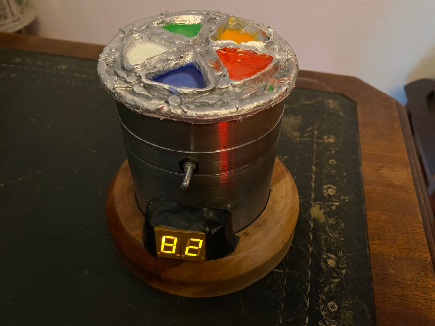

# Arduino adjustable thermostat with display
Thermostat set by potentiometer with display
Controlled by an Arduino Nano

### HARDWARE:

- Arduino Nano or compatible
- 2x 7-Segment LED
- 10k Potentiometer
- 10k Thermistor
- 10k Resistor
- Relay PCB
